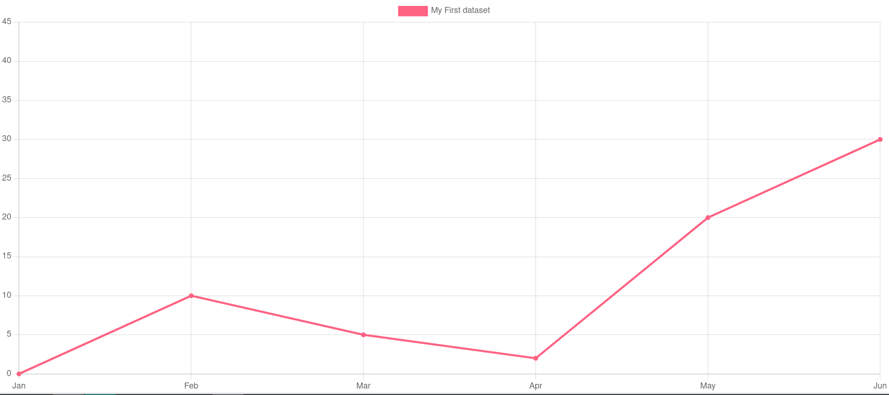

Earlier this week, I was searching for ways to implement a chart into my React app until I came across a library called chart.js. It seemed like a splendid library, so I gave it a try. Here are the steps I used to make a functioning chart in my React app.

## Install the chart.js node module

Make sure you have `npm` and `node` installed on your system. To install chart.js using npm, run `npm install chart.js` in the root folder of your project. This will add the chart.js library to the `node_modules` directory in your project. 

## Import the Chart.js library to a Javascript file

According to the <a href="https://www.chartjs.org/docs/latest/getting-started/integration.html#bundlers-webpack-rollup-etc" target="_blank">documentation</a>:

> Chart.js 3 is tree-shakeable, so it is necessary to import and register the controllers, elements, scales and plugins you are going to use.

This means that simply importing `Chart` from 'chart.js' will not suffice. There are 3 ways you can import and register the necessary things for your project. This is the way I used, as it requires the least amount of code:

```
import Chart from 'chart.js/auto';
```

## Use the useEffect React Hook to execute Javascript code after the component is rendered

For this tutorial, I will be using the sample chart provided by <a href="https://www.chartjs.org/docs/latest/getting-started/" target="_blank">chart.js's docs</a> (Licensed under the <a href="https://github.com/chartjs/Chart.js/blob/master/LICENSE.md" target="_blank">MIT license</a>).

To begin, make a new functional component returning a `<canvas>` element wrapped with a `<div>` element:

```
function MyGraph() {
  return (
    <div>
      <canvas id="graph"></canvas>
    </div>
  );
}
```

Then, since using the `<script>` tag in the functional component did not work as intended, I used the `useEffect()` hook to run javascript code after the component was rendered on the page:

```
function MyGraph() {
  useEffect(() => {
    //graph setup
    const labels = [
      'Jan',
      'Feb',
      'Mar',
      'Apr',
      'May',
      'Jun',
    ];

    const data = {
      labels: labels,
      datasets: [{
        label: 'My First dataset',
        backgroundColor: 'rgb(255, 99, 132)',
        borderColor: 'rgb(255, 99, 132)',
        data: [0, 10, 5, 2, 20, 30, 45],
      }]
    };

    //graph configuration
    const config = {
      type: 'line',
      data: data,
      options: {}
    };
}
```

To render the chart, an instance of the `Chart` class needs to be instantiated inside the `useEffect()` hook, like so:

```
function MyGraph() {
  useEffect(() => {
    //graph setup
    const labels = [
      'Jan',
      'Feb',
      'Mar',
      'Apr',
      'May',
      'Jun',
    ];

    const data = {
      labels: labels,
      datasets: [{
        label: 'My First dataset',
        backgroundColor: 'rgb(255, 99, 132)',
        borderColor: 'rgb(255, 99, 132)',
        data: [0, 10, 5, 2, 20, 30, 45],
      }]
    };

    //graph configuration
    const config = {
      type: 'line',
      data: data,
      options: {}
    };

    var graph = new Chart(
      document.getElementById('graph').getContext('2d'),
      config
    );
  });

  return (
    <div>
      <canvas id="graph"></canvas>
    </div>
  );
}
```

As you can see, we passed the element with id `graph` and the `config` object we created earlier to the new `Chart` class instance.

When you run the application, the graph should look something like this: 



I hope this article helped. If you find an error or typo in one of my articles, please let me know.

**NOTE: I AM NOT LIABLE FOR ANY DAMAGES THAT HAPPEN BECAUSE OF YOU FOLLOWING ONE OF MY ARTICLES. This is not to say the information here is incorrect. Please be careful.**

Thumbnail image by source: <a href="https://pixabay.com/vectors/gui-interface-internet-program-2311261/" target="_blank">https://pixabay.com/vectors/gui-interface-internet-program-2311261/</a>